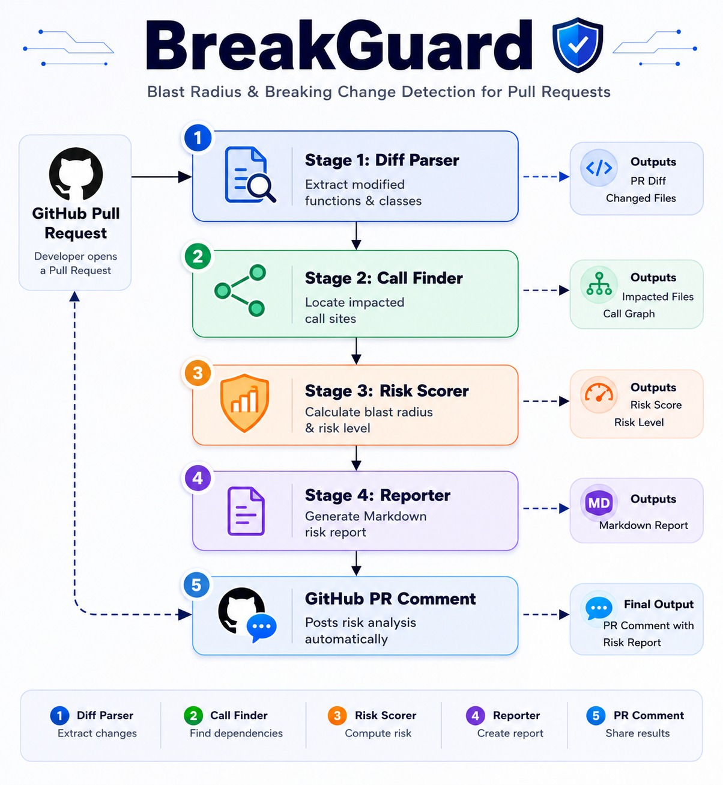

# 🛡️ BreakGuard

> **Blast Radius & Breaking Change Detection for Pull Requests**

BreakGuard is an intelligent GitHub Action that analyzes Pull Request (PR) changes, identifies potential breaking changes, discovers affected parts of the codebase, evaluates test coverage, calculates the blast radius, and posts an automated risk analysis before the PR is merged.

---

## 🚀 Overview

Modern CI/CD pipelines mainly verify whether code builds successfully and tests pass. However, they often fail to identify the broader impact of code modifications across a project.

BreakGuard bridges this gap by analyzing source code changes and estimating their potential impact before they reach production.

---

## 🏗️ Architecture

The following diagram shows how BreakGuard analyzes a Pull Request, identifies impacted code, evaluates risk, and posts an automated report back to GitHub.


## ❓ Problem Statement

When developers modify or remove functions, classes, or APIs, the changes may unintentionally affect multiple parts of the application.

Traditional CI pipelines can report whether tests pass, but they generally do not answer important questions such as:

- Which files depend on the modified code?
- How many modules are affected?
- Are the affected components covered by tests?
- What is the overall risk of merging this Pull Request?

BreakGuard answers these questions automatically.

---

## 💡 Solution

BreakGuard performs static code analysis on Pull Requests to:

- Detect modified Python functions and classes
- Identify impacted call sites throughout the repository
- Analyze test coverage for affected code
- Estimate the Blast Radius score
- Assign a High, Medium, or Low risk level
- Generate a detailed Pull Request risk report

---

## ✨ Features

- 🔍 Pull Request Diff Analysis
- 🌳 Python AST Parsing using Tree-sitter
- 📞 Call Site Detection
- 📊 Blast Radius Calculation
- 🧪 Test Coverage Analysis
- ⚠️ Breaking Change Detection
- 📄 Automated Risk Report Generation
- ⚙️ GitHub Actions Integration
- 🐳 Docker Support

---

## 🔄 Workflow

```text
GitHub Pull Request
        │
        ▼
Diff Parser
        │
        ▼
Call Finder
        │
        ▼
Risk Scorer
        │
        ▼
Reporter
        │
        ▼
GitHub PR Comment
```

## 📁 Project Structure

```text
BreakGuard/
│
├── .github/
│   └── workflows/
│       └── test.yml
│
├── docs/
│   ├── architecture.md
│   ├── architecture.png
│   └── validation.md
│
├── src/
│   ├── main.py
│   ├── diff_parser.py
│   ├── call_finder.py
│   ├── github_client.py
│   ├── reporter.py
│   ├── risk_scorer.py
│   └── models.py
│
├── tests/
│   ├── sample_repo/
│   ├── test_diff_parser.py
│   ├── test_call_finder.py
│   └── test_risk_scorer.py
│
├── Dockerfile
├── action.yml
├── requirements.txt
└── README.md
```

---

## ⚙️ Installation
```

### Clone the repository

```bash
git clone https://github.com/Ankita-b500/BreakGuard.git
cd BreakGuard
```

### Create a virtual environment

```bash
python -m venv venv
```

### Activate the virtual environment

### Windows

```bash
venv\Scripts\activate
```

### Linux / macOS

```bash
source venv/bin/activate
```

### Install dependencies

```bash
pip install -r requirements.txt
```
## 🧪 Running Tests

Run all tests using:

```bash
pytest
---

## ▶️ Usage

After installation, configure the GitHub Action in your repository and create a Pull Request.

BreakGuard will automatically:

1. Analyze the PR diff
2. Detect changed symbols
3. Find impacted call sites
4. Evaluate test coverage
5. Calculate the Blast Radius
6. Post a risk report on the Pull Request

---

## 🛠️ Tech Stack

- Python 3.x
- GitHub Actions
- Docker
- Tree-sitter
- GitPython
- NetworkX
- Markdown

---

## 👥 Team Members

| Member | Responsibility |
|---------|----------------|
| **Ankita** | Integration, GitHub Actions, Docker, Documentation |
| **Dinesh** | Diff Parser |
| **Swati** | Risk Scorer |
| **Daina** | Testing, Sample Repository & Documentation |

---

## 📌 Future Improvements

- Support additional programming languages
- Interactive dependency graph visualization
- AI-powered risk prediction
- IDE plugin support
- Historical change analytics

---

## 📄 License

This project was developed for a Hackathon and is intended for educational and demonstration purposes.

---

⭐ If you find this project useful, consider giving it a star!